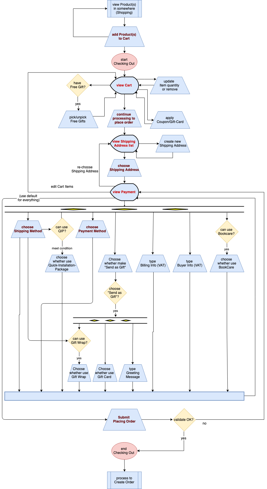

Vậy là sau hơn 1 năm gắn bó và làm việc ở Tiki ở vị trí Software Engineer (SE) cụ thể hơn là Back-End Engineer thuộc Checkout and Payment team. Đây là bài blog đầu tiên của mình sẽ chia sẻ business và technical của một hệ thống lớn E-Commerce ở Việt Nam về các vấn đề Cart Processing, Promotion, Payment, Deal Processing, Order Routing, Order Processing.
# Checkout

 Có thể hiểu đơn giản Checkout & Payment là một flow đi từ lúc bạn add sản phẩm vào giỏ hàng và thanh toán, đây cũng chính là thành phần quan trọng nhất trong một hệ thống E-Commerce. Dưới đây là checkout flow detail ở Tiki
 
 
 
 Chính vì vậy Checkout phải đáp ứng các requirement sau:
  * Single responsibility, high availability, low latency.
  * Scaleable, reuseable, extendable, maintainable.
  * Support non-blocking, asynchronous, muli-threaded when needed.
  * Well-tested.

<!--#### Cart Processing

Cart Processing là một component cực kỳ phức tạp bao gồm: insert/update/delete sản phẩm, tính toán và apply promotion.

##### Cart Info

Các bạn có bao giờ bạn add sản phẩm vào giỏ hàng và rất lâu sau đó 1 ngày hoặc có thể 1 tháng bạn vào lại giỏ hàng mà vẫn nhìn thấy sản phẩm trong giỏ hàng vẫn còn y nguyên? Có hai cách là lưu giỏ hàng xuống một RDBMS hoặc NoSQL và ở Tiki đã và đang dùng hai cách trên.

RDBMS: Tiki đã từng dùng MySQL để lưu cart info (product, shipping address, payment info) nhưng do số lượng write và read quá cao khi customer request get cart info hệ thống sẽ tính toán lại và update lại vào DB điều đó làm cho hệ thống không thể extendable.

NoSQL: Tiki hiện tại đang dùng MongoDB để lưu info của cart. Vì sao Tiki lại dùng MongoDB để lưu thì mình nói trong một bài viết khác.

##### Promotion

Promotion ở Tiki rất là complex vì không chỉ đơn giản là apply coupon xong nhận được discount mà có thể nhập coupon vừa được discount vừa được free gift, hoặc sản phẩm đó được tặng gift nào.

Khi user request get cart info, hệ thống sẽ lấy ra những rule nào đang active đang chạy (Redis or MySQL) và chạy qua một bộ validator để validate cart của customer có đủ điều kiện để apply những promotion không có coupon hay không.

#### Payment

Có thể nói đây chính là phần quan trọng của Checkout & Payment vì liên quan đến tiền bạc, mà đã dính đến tiền bạc thì có rất nhiều vấn đề xảy ra nếu như hệ thống xử lý không tốt. Vì thế phải đáp ứng đủ các yêu cầu sau:
 * Extendable
 * Consistency

<!-- Bạn muốn mua một hay nhiều sản phẩm cùng lúc? Việc của bạn là cần add sản phẩm đó vào cart để mua hàng, nhưng bạn lại không muốn mua ngay lúc đó mà vài ngày sau bạn quay lại mua các sản phẩm đó mà lúc trước bạn đã add vào cart. Nhưng thật không may các sản phẩm mà bạn đã add trước đó đều đã mất. Để giải quyết vần đề trên thì có các solution sau:

Dùng DBMS: Lúc trước ở Tiki bọn mình dùng MySQL để save những gì trong cart của bạn (product, shipping address, selected payment) nhưng bọn mình gặp phải cấn vấn đề khi số lượng CCU quá cao như những lúc chạy deal, event quá hot dẫn đến việc write (add, update,remove product ở cart) vào master db quá cao (ở Tiki bọn mình dùng master - slave) và do một phần code trước đó đều select lại cart từ con master dẫn đến con master chịu tải không nỗi.

Dùng MongoDB: Đây là solution hiện tại bọn mình vẫn đang dùng đến hiện tại, tại sao bọn mình lại chọn MongoDB mà không phải Redis, Memcached hay một thứ gì đó persist on disk. -->
